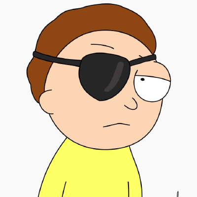

# RafaelMeir4

{ loading=lazy style="height: 150px"}

## Informações Pessoais

### Quem sou eu?

Hey guys, meu nome é Rafael 👽. Sou estudante de Análise e Desenvolvimento de Sistemas na UNIMETROCAMP e faço parte da Ominira desde 28/09/2024. De técnico em Gastronomia a desenvolvedor de software, me apaixonei pela área e por tudo o que é possível proporcionar através da tecnologia.

### Contato

- Email: rafaelmeira2020@gmail.com
- GitHub: [RafaelMeir4](https://github.com/RafaelMeir4)

## Interesses

### Linguagens de Programação

- C
- PHP
- Python
- React.js

### Projetos Ominira

Aqui está meu nível de interesse em contribuir para os seguintes projetos da Ominira:

- Quaac - 🔴🔴🔴🔴🔴🔴🔴🔴⭕⭕
- RastreadorSangue API - 🔴🔴🔴🔴🔴🔴🔴🔴🔴🔴
- LivrEtec - 🔴🔴🔴🔴⭕⭕⭕⭕⭕⭕
- Plataforma de Apadrinhamento - 🔴🔴🔴🔴🔴🔴🔴🔴🔴🔴

## Checklist

- ⭕ Fiz MC102
- ✔️ Abri uma IDE de Programação
- ✔️ Criei um Hello World
- ✔️ Criei um commit
- ✔️ Programei em conjunto com outras pessoas
- ✔️ Desenvolvi um Site
- ✔️ Desenvolvi uma API
- ✔️ Desenvolvi uma aplicação mobile
- ✔️ Desenvolvi uma aplicação desktop
- ✔️ Criei um teste unitário
- ⭕ Participei em projeto comunitário
- ⭕ Fiz um PR para projeto FOSS
